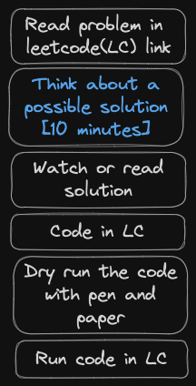

# Leetcode Solutions
This is a collection of solutions to common Leetcode questions _(in progress)_, based on a list compiled by [Neetcode](https://neetcode.io/practice).

The solutions are in Python3. Required explanations are provided as comments within the script file. If more detailed explanations are necessary, they will be included in an accompanying markdown file.

- You can find the list of questions that are covered in this repo [here](questions_list.md)

I recommend the following line-of-action if you are attempting a problem for the _FIRST time_:

## Issues
If you face any issues or have any suggestions, please feel free to open an issue. I will try to get back to you as soon as possible.

## More questions?
If you want to contact me, you can reach me via [email](mailto:aksharasoman@gmail.com) or visit [my website](https://aksharasoman.github.io).
